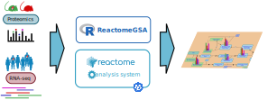
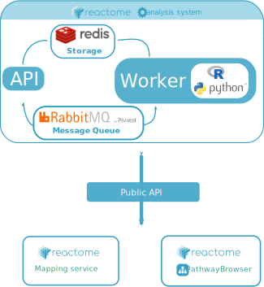

# ReactomeGSA Analysis System



The ReactomeGSA Analysis System is a kubernetes application to perform
multi-species, multi-omics, comparative pathway analyses.

The system provides an API that allows programmatic access to these analysis
functions. Currently, the main tool to **use the ReactomeGSA Analysis System**
is the [ReactomeGSA R Package](https://github.com/reactome/ReactomeGSA).

## Project structure

The ReactomeGSA Analaysis System consists of multiple components:

**Python modules**:

  * `reactome_analysis_utils`: Common utility functions shared by all other python modules
  * `reactome_analysis_api`: Module that provides the publicly accessible API
  * `reactome_analysis_worker`: Module that performs the actual gene set analysis.
  * `reactome_analysis_report`: Module that creates nicely formatted reports from the analysis results.

**Infrastructure**:

  * `docker`: This directory contains the Docker files and a build script to create the containers for each 
     of the python modules. The containers are then run using kubernetes.
  * `kubernetes`: The kubernetes YAML file to deploy the ReactomeGSA Analysis System on a kubernetes cluster.

## System design



The system exposes a [public API](http://gsa.reactome.org) (python module `reactome_analysis_api`) which is the 
only externally visible part of the system. This API receives the JSON-encoded analysis requests and posts it
to the `RabbitMQ message queue`.

The `reactome_analysis_worker` listens to the `RabbitMQ message queue` and is automatically scaled by kubernetes.
The `reactome_analysis_worker` currently processes all analysis requests using different `analysers`. These currently
all use `R` based methods. The respective `R` scripts are found in `reactome_analysis_worker/resources/r_code`. During 
the analysis, the current status is stored in the `redis` storage.

Once an analysis is complete, the result is stored in the `redis` storage and the status updated accordingly. If a
report or e-mail notification was requested by the user, the `reactome_analysis_worker` posts a report generation
request to the `RabbitMQ` message queue.

The `reactome_analysis_report` module listens to the `RabbitMQ report message queue`. It currently creates Microsoft
Excel and PDF reports to represent the analysis result. These files are also stored in the `redis` storage. Finally,
if specified, the `reactome_analysis_report` module sends a notification e-mail that the analysis is complete.

## Building the containers

The three main components (API, worker, and report) are all executed within their own containers. The respective
docker files are found in the `docker` directory. This directory additionally contains the `build_images.sh` script
which interactively builds the image in linux based systems (tested on Ubuntu 19.04).

## Deploying the ReactomeGSA Analysis System

The ReactomeGSA Analysis System can easily be deployed on any kubernetes cluster. For tests, we recommend to use
(minikube)[https://github.com/kubernetes/minikube]. (minikube)[https://github.com/kubernetes/minikube] allows
you to run a kubernetes cluster with a single command on your own computer.

Then, simply download the (kubernetes/analysis_system_example.yaml)[kubernetes/analysis_system_example.yaml] file
to your computer. Once minikube is installed and running, simply execute:

```bash
kubectl apply -f analysis_system_example.yaml
```

## Getting help & reporting issues

To get help or report issues, simply [post a new issue](https://github.com/reactome/gsa-backend/issues).